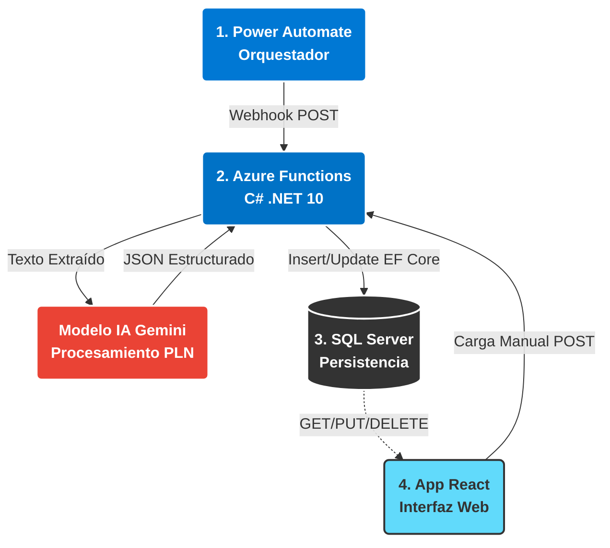

# ⚡ Procesador Inteligente de Facturas (Serverless Backend)

Este repositorio contiene el backend de procesamiento de documentos implementado bajo una arquitectura **Serverless** utilizando **Azure Functions (.NET 10 - Isolated Worker)**. 

El microservicio se encarga de recibir facturas en formato PDF, extraer su contenido de texto, procesarlo mediante Inteligencia Artificial (Google Gemini) para estructurar los datos y persistirlos en una base de datos relacional.

## 🏗️ Flujo de Trabajo Arquitectónico (IDP)

A continuación, se detalla el Flujo de Procesamiento Inteligente de Documentos (IDP) :



### ⚙️ Componentes del Flujo:
1. **Captura y Disparo (Power Automate):** Detecta un correo con la factura adjunta y dispara una petición HTTP POST al webhook. Alternativamente, la petición POST puede provenir directamente de la carga manual en el frontend.
2. **Procesamiento Inteligente (Azure Functions + Gemini):** El endpoint serverless recibe el archivo `multipart/form-data`. Extrae el texto y envía la data cruda a la IA de Google con un *prompt* para recuperar un JSON formateado.
3. **Persistencia y Control (SQL Server):** Deserializa la respuesta de la IA en DTOs y guarda el registro utilizando `Entity Framework Core`.
4. **Consumo y Salida (React):** A través de los endpoints expuestos, la interfaz web permite a los usuarios visualizar la tabla de facturas y administrar los registros (CRUD).

## 🚀 Tecnologías Utilizadas

*   **Framework:** .NET 10 (C#)
*   **Runtime:** Azure Functions (Modelo Isolated Worker)
*   **ORM:** Entity Framework Core
*   **Lectura de PDF:** UglyToad.PdfPig
*   **Manejo de Formularios:** HttpMultipartParser
*   **Inteligencia Artificial:** Google Gemini API (modelo `gemini-3.5-flash-lite`)

## 🔌 Endpoints de la API

| Método | Endpoint | Descripción | Body / Params |
| :--- | :--- | :--- | :--- |
| `POST` | `/api/Facturas/update` | Procesa un PDF con IA y lo guarda | `multipart/form-data` (campo: `archivo`) |
| `GET` | `/api/Facturas` | Obtiene todas las facturas procesadas | N/A |
| `GET` | `/api/Facturas/{id}` | Obtiene una factura específica | `id` en la URL |
| `PUT` | `/api/Facturas/{id}` | Actualiza manualmente una factura | JSON con datos de la factura |
| `DELETE`| `/api/Facturas/{id}` | Elimina un registro del sistema | `id` en la URL |

## 🛠️ Instalación y Ejecución Local

1. Asegúrate de tener instalado el **SDK de .NET 10** y las **Azure Functions Core Tools**.
2. Clona este repositorio y navega a la carpeta raíz.
3. Crea un archivo `local.settings.json` con la siguiente estructura:

```json
{
  "IsEncrypted": false,
  "Values": {
    "AzureWebJobsStorage": "UseDevelopmentStorage=true",
    "FUNCTIONS_WORKER_RUNTIME": "dotnet-isolated",
    "ConnectionStrings:DefaultConnection": "Server=TU_SERVIDOR; Database=TU_BD; User Id=TU_USUARIO; Password=TU_CLAVE; TrustServerCertificate=True;",
    "Gemini:Model": "gemini-3.5-flash-lite",
    "Gemini:ApiKey": "TU_API_KEY_DE_GEMINI"
  },
  "Host": {
    "CORS": "*"
  }
}
```

4. Restaura los paquetes y ejecuta las migraciones (si aplica):
   ```bash
   dotnet restore
   dotnet ef database update
   ```
5. Inicia el servidor local de Azure Functions:
   ```bash
   func start
   ```
El servicio estará disponible de forma predeterminada en `http://localhost:7071`.